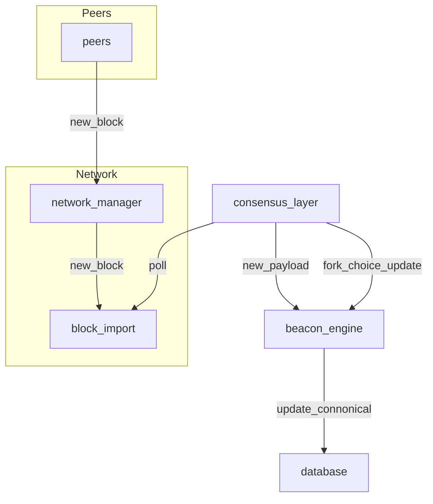
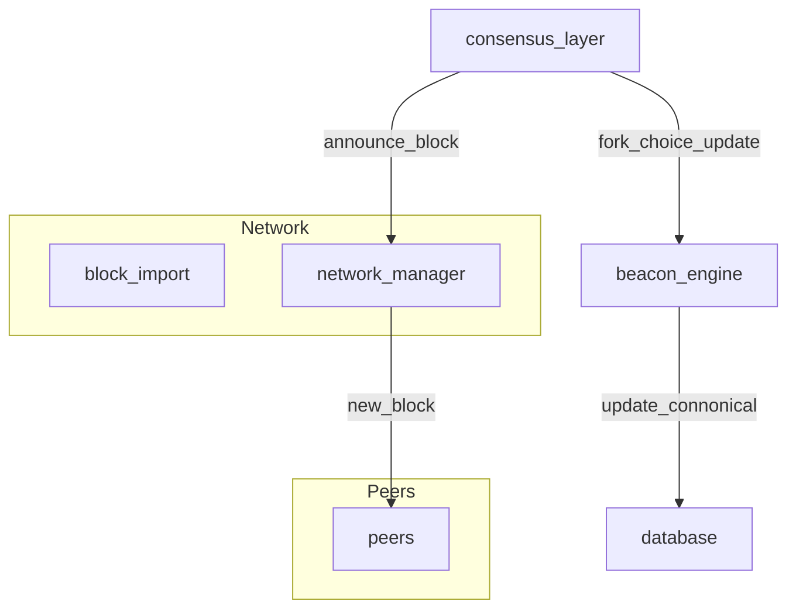

# Block Propagation

This document outlines the process of block propagation within the Reth ecosystem.

## Participants

### Network Manager

The network crate oversees the node's connections to the Ethereum peer-to-peer (P2P) network, facilitating communication with other nodes through various P2P subprotocols. It manages connections and handles requests and responses from peers. For a detailed understanding of the networking crate, refer to [this](https://github.com/paradigmxyz/reth/blob/main/docs/crates/network.md).

### Block Import

Block import is an optional field in the network manager setup. It receives notifications about new incoming blocks from peers and can optionally conduct consensus validation before propagating them. The Consensus Layer (CL) receives notifications from block import when new valid blocks are received, delivered in the form of an unbound receiver stream.

### Consensus Layer (CL)

The Consensus Layer carries two primary responsibilities:

1. Generating blocks following the PoA consensus spec and broadcasting these blocks when ready.
2. Conducting consensus validation on incoming blocks and updating the canonical ordering of blocks if they're deemed valid.

### Beacon Engine

The beacon consensus engine functions as the driver that switches between historical and live sync modes. It operates based on messages from the Consensus Layer, which are received through the Engine API (JSON-RPC).

The consensus engine has two data input sources:
##### New Payload (`engine_newPayloadV{}`)
The engine receives new payloads from the CL. If the payload is connected to the canonical
chain, it will be fully validated added to a chain in the [BlockchainTreeEngine]: `VALID`

##### Forkchoice Update (FCU) (`engine_forkchoiceUpdatedV{}`)

This contains the latest forkchoice state and the payload attributes. The engine will attempt to
make a new canonical chain based on the `head_hash` of the update and trigger payload building
if the `payload_attrs` are present and the FCU is `VALID`.

### Database

The database stands as a central component within Reth, providing persistent storage for data such as block headers, block bodies, transactions, and more. For further details, refer to [this](https://github.com/paradigmxyz/reth/blob/main/docs/crates/db.md).

### Peers

Peers represent both incoming and outgoing connections established with peers within the botanix network.

### Diagram New Block From Peer

The following diagram displays the steps taken within reth to update the block db after performing consensus validation.

### Diagram New Block Discovered
The following diagram displays the steps taken within reth to update the block db and notify the rest of the network about your new block

