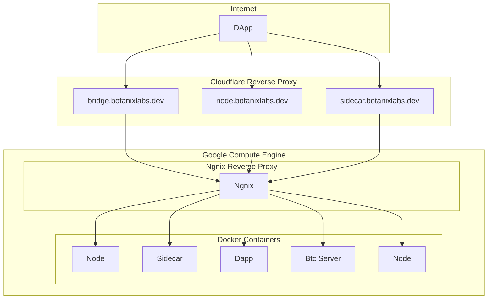

### Summary
This diagram represents the Botanix web architecture hosted on Google Compute Engine and served through an Nginx reverse proxy. The various parts of the application is accessed through various subdomains, which are routed through Cloudflare's reverse proxy for added security and performance. The Google Compute Engine hosts Nginx for proxying requests and multiple Docker containers that run different components of the application, including Node.js, Sidecar, the DApp itself, and a Bitcoin server. The diagram illustrates the connections between these components and how they interact to serve the DApp to users.

### Diagram

