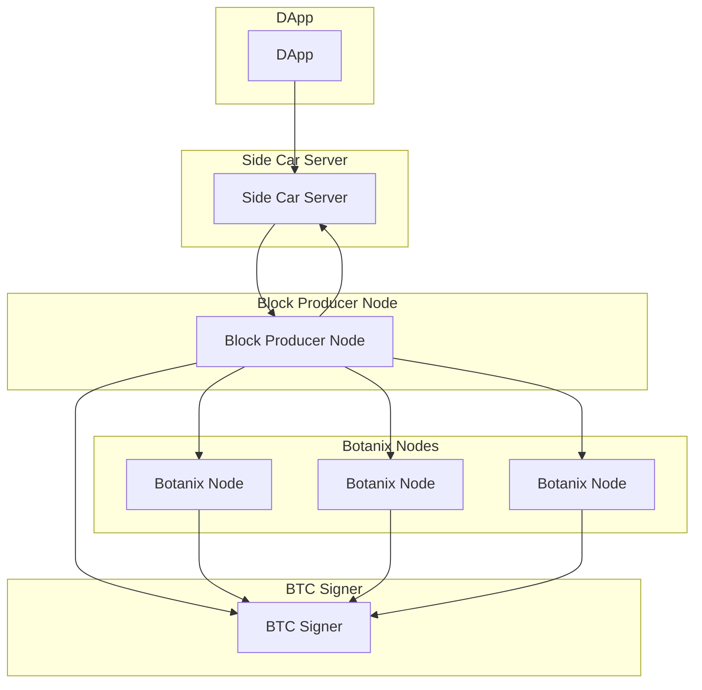

# Testnet V0

## Participants
### Dapp:
The Dapp serves as the front-end interface. Its core functionality revolves around extracting the user's Ethereum account address from their preferred web3 wallet. In addition to this, it offers the capability for users to engage with pegging in and out of the Botanix Sidechain. Pegging in entails the generation of a nonce along with a corresponding commitment to this nonce. The creation of a nonce commitment involves signing the hash of the nonce (see docs/pegin.md for more info). Pegging out involves sending a Bitcoin amount and address to the Genesis contract. 

### Side Car Server:
The process of pegging into the Botanix system is inherently complex, involving access to various resources such as a block source and a Botanix RPC server. To streamline and simplify this intricate pegging procedure, the Side Car Server plays a pivotal role. This component exposes several of RESTful endpoints to facilitate the peg in/out process:
1. The "Get Pegin Address" endpoint necessitates specific input parameters including the nonce and Ethereum address. Its output provides the pegin address.
2. The "Submit Peg Transaction" endpoint is designed to accept the on-chain pegin bitcoin transaction. This refers to the transaction in which the user sends bitcoins to the gateway address. Once this transaction accumulates a confirmation depth of six blocks, the Side Car Server undertakes the generation of a pegin proof. Subsequently, it broadcasts a transaction to the Botanix testnet network.
1. Request "Pegout Transaction" endpoint creates a contract interaction transaction calling into the burn function of the genesis contract. Botanix consensus will listen for the burn topic emission and only generate a pegout if the user has enough funds to cover the pegout amount + L1 on-chain fees.

### Block Producer Node / Botanix Nodes:
The ecosystem includes Ethereum nodes, adhering to the standards set by the Botanix protocol -- namely verifying pegins and pegouts. In the context of testnet v0, a single botanix node assumes the responsibility of mining and producing blocks. It is imperative to note that testnet v0 is a self-contained environment, inaccessible through the public internet. These nodes are exclusively reachable by computing resources within our cloud Virtual Private Cloud (VPC). To emphasize, the node RPC connections are exclusively accessible to the Side Car Server.

### BTC Signer:
Within testnet v0, the system is devoid of a multisig federated sidechain. In its current configuration, it encompasses a solitary signer accessible via gRPC, aptly named the BTC Signer. This entity administers a database of spendable Unspent Transaction Outputs (UTXOs), dynamically updating this inventory upon the introduction of new peg ins and outs. Furthermore, the BTC Signer exposes an endpoint facilitating the retrieval of its internal taproot key's public key. Lastly, the BTC Signer shoulders the responsibility of executing all pegouts. Specifically, upon the emission of a burn topic from the minting/genesis contract, the BTC Signer orchestrates the construction of a bitcoin transaction, drawing from the available pool of UTXOs.
### Diagram

