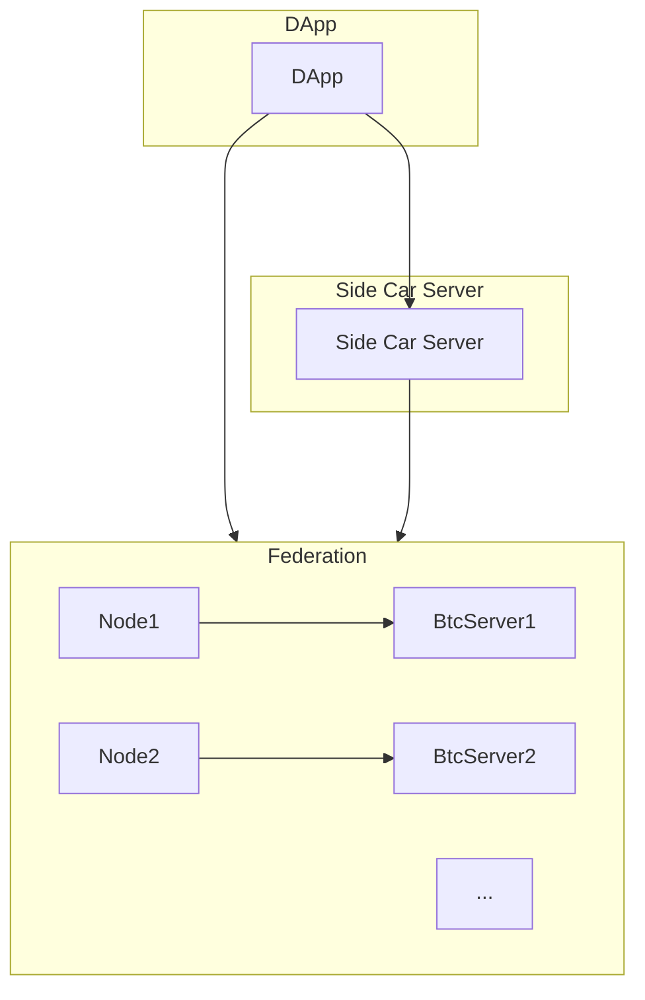

# Testnet V1

The following document describes the technical details of the Federated Botanix Sidechain.

## Requirments

##### What are we building?

- Federation of a block producing and validating nodes
- FROST-style multisig consisiting of federation memebers

## Non-Requirments

#### What are we not building?

This document outlines many different components and how they may be softforked in the future. However, we should clearly lable what we are not delivering as part of v1.
These components are

- Staking
- Slashing staking participants
- Dynamic federation
- Finality commitments
- Safe Spend Path (SSP)

## Participants

### Dapp:

The responsibilities of the dapp have not changed from v0. Please refer to docs/testnet_v0.md.

### Side Car Server:

The responsibilities of the sidecar service have not changed from v0. Please refer to docs/testnet_v0.md.

### Federation:

The ecosystem includes Botanix nodes, adhering to the standards set by the Botanix protocol -- namely verifying pegins, verifying pegouts and following the clique POA consensus for block production.

### BTC Signer:

Within testnet v1, each federation member will run a solitary bitcoin signer accessible via gRPC, aptly named the BTC Signer. This entity administers a database of spendable Unspent Transaction Outputs (UTXOs), dynamically updating this inventory upon the introduction of new peg ins and outs. Furthermore, the BTC Signer exposes an endpoint facilitating the retrieval of its internal taproot key's public key. Lastly, the BTC Signer shoulders the responsibility of executing all pegouts. Specifically, upon the emission of a burn topic from the minting/genesis contract, the BTC Signer orchestrates the construction of a bitcoin transaction, drawing from the available pool of UTXOs.

Lastly, the BTC Signer will also be encumbered with the responsibilites of FROST signing. Including participating in Distributed Key Generation (DKG) and signing.

### Diagram



### Implementation Details

The following describes in detail each technical component needed to build a federated bitcoin sidechain.

#### Proof Of Authority (PoA)

Our consensus mechanism will follow the [EIP-225 Clique Specification](https://eips.ethereum.org/EIPS/eip-225).
There are some details that needs to change due to technical constraits of the federation.

1. Federation memebers will be stored as 33-byte compressed secp256k1 public keys and stored in the EDH. More on this below
1. The Federation memeber being voted on will be repersented at a 33-byte compressed secp256k1 public key and will live in EDH.
1. In turn Block producer index is selected via: `bitcoin_block_hash % n`

There are several clear drawbacks from this approach. Mainly a dishonest node maybe able to sign non-optimal block or sign for a block that fails consensus protocol check.
If a node fails to provide a valid block while `IN_TURN` then the network suffers a chain halt of ~10 min till a new bitcoin block is mined.

**Note:** Federation memebers are only block producers. A seperate set of keys are responsible for spending and managing the multisig wallet.

**Open Question:**
* Do we need a threshold consensus on valid blocks before they are produced (liquid's 3 stage commitment). If so this could reduce block time.
Notes: Longer term federation will be disbanded, so this is not really needed. 
Notes: consensus does become massively easier to develop when there are no `OUTTURN` block producers.

* Using system clock will mitigate the need for nodes to sync on more than one source of truth. Can we use system clock for round robin selection


##### Block Selection

The Botanix v1 federation employs a round-robin selection mechanism, akin to the one described in the clique spec (EIP255), for choosing block producers. The selection process involves taking the (tip - 100)'th Bitcoin block hash modulus the number of federation members. This method has two notable implications:

1. If a block producer is offline, it triggers a chain halt lasting, on average, 10 minutes.
2. The random nature of block producer selection prevents focused attacks on nodes that might otherwise be deterministically chosen as the next block producer.

While this consensus mechanism is straightforward to comprehend and implement, it comes with certain drawbacks, particularly the requirement for synchronized time and a consistent block source. Alternatively, a Liquid-style approach could use the system clock without involving the Bitcoin network, but this sacrifices randomness.

##### Re-Orgs

Forks in the given consensus mechanism can occur under the following conditions:

- If a block producer broadcasts a block while `IN_TURN` and a new Bitcoin block is discovered during gossip, that node is no longer `IN_TURN`, leading to network segmentation.
- Implementing a Liquid-style 3-stage commitment might be a potential solution to this issue, possibly the only way to address it in the short term.

In addition, block-producing nodes are advised not to produce a forked block deeper than 1 block. This ensures that users have the privilege of knowing when their transaction is 1 block away from being finalized. For those seeking proof-of-work finality, waiting for an `EPOCH_LENGTH` amount of blocks is necessary (more details below).

#### Extra Data Header (EDH)

Botanix will encounter numerous new consensus-critical components that require monitoring, such as federation members, UTXOs entering or exiting the network, and withdrawal signatures. Expanding the Ethereum standard header poses a risk of compatibility issues with future clients and could necessitate excessive refactoring efforts.

As an alternative, this document proposes extending the header's extradata field to accommodate these emerging consensus properties. This approach aims to avoid compatibility challenges and streamline the integration of new components without introducing unnecessary refactoring complexities.

The following data serlialization format outlines how the EDH will be formated
| Field | Description | Size |
|------------------------|-------------------------------|-------|
| Version | | 4 byte|
| Federation members | List of Secp256k1 Public Keys | Variable size |
| Federation to be voted on | optional field, not all blocks are going to include a vote | 33 bytes |
| Bitcoin block hash | Current bitcoin Tip according to the block producer | 32 bytes |
| Bitcoin base fee | Current competitive L1 fee | 4 bytes |
| Root of UTXO merkel tree | | 32 bytes |
| Federation Signature | secp256k1 recoverable signature. Signing over the entire eth header with the EDH concatinated at the end. Also optional, the data structure itself should encodable/decodable without the signature | 65 bytes |

**Note**: The list of federation members will not be changing during the epochs. Since nodes will only start sync at the start of an epoch, there is no need to store the federation in in its entirety every blocks.

**Open Questions**: How / should we encode multisig participants in EDH? 

##### Relevant files

- [extra_data_header.rs](https://github.com/botanix-labs/Macbeth/blob/main/crates/botanix-lib/src/extra_data_header.rs)

##### V1 Version

V1 testnet will consume version `0x0` for EDH. For version 0 Botanix consensus will not allow EDH with a vote field. Additionally the number of federation memebers will be limited to 15.

#### Epochs

Epoch serve multiple purposes. Mainly they serve as a statless checkpoint in which consensus descions are made and which nodes can use to sync from.

Epoch lenghts are defined by the eip-255 `EPOCH_LENGTH` field.

##### Epoch events

###### Federation Votes

Epoch blocks must not include any votes. Instead the epoch block producer is must decide on the next list of federation members given the votes during the epoch.

###### Withdrawal Signatures

A reminder that FROST signing sessions are both interactive and commit to a subset of the signing group. If a participant becomes interactive during the signing session, the entire process is halted. To resume, we must return to step one and choose a different signing set. Consequently, **signing withdrawal requests are restricted to epoch blocks only**. This approach aims to maintain the speed of normal non-epoch blocks, making an exception for epoch blocks to handle interactivity. Moreover, it allows signers to batch signing requests, capitalizing on opportunities when a reliable set of signers is online.

**Steps:**

1. On an epoch block, a coordinator is randomly selected, as described above. However, an out-of-turn block producer may not be chosen to produce an epoch block due to the interactivity demands of FROST and the risk of double signing a pegout transaction.
1. Federation members begin to contribute nonces to the round cordinator
1. Cordinator produces a sighash (message) and broadcasts
1. Signers contribute partial signatures and broadcast to the cordinator
1. After a `T` time the cordinator batches pegouts into one bitcoin transaction and broadcasts
1. If there are remaining pegouts that we're not processed they will get noted in the EDH and picked up in the next epoch block

**Open Question:**

- Should signing requests be persisted in EDH for easy access by the coordinator?
- Should the round cordiantor contribute signatures as well?
- Decide on a `EpochLength`?

#### Multisig

##### P2P Gossiping

FROST is a multi-round interactive protocol. There are two main ways to solve the interactivity demands of FROST.

1. FROST participants store and commuinicate with one another using the EDH and the botanix blocks. There are clear drawbacks with this approach. Participants will have to contribute signatures during blocks and oncurr the block delay
1. (Liquid Approach) Utilizing the gossip network.

The rest of this document assumes FROST interactivity will occur over an authenitcated and confidential gossip network.

TODO: specify gossip message structure

##### DKG

The key goal of DKG is to ensure that the final generated key is both unpredictable and secure, even in the presence of malicious participants or communication failures. This is achieved through a series of interactive steps that involve multiple participants working together to contribute information and perform computations.

To obtain an aggregate key, signers are required to contribute their partial shares to each participant. The `btc_signer` service is responsible for storing each participant's key in its database, including its own. If the key of any participant is missing, any endpoint attempting to expose the aggregate key should either return `null` or throw an error, indicating that generating a gateway address is currently not feasible.

It is crucial to note that Distributed Key Generation (DKG) can only take place offline if a single entity controls all the keys. While this scenario may be feasible in a Testnet setting, it is not applicable to the mainnet.

The Bitcoin signer must adhere to the following steps:

1. Initialize with a set of federation public keys.
1. Set the quorum of signers to `math.floor(N * 2/3)`.
1. Check the database for partial shares.
1. If there are no shares or some are missing, DKG must commence.
1. Upon successful DKG, the reconstructed aggregate key must be saved in the database along side partial shares of each participant.

**Note:** FROST reqiures each particiapant to have a identifier. While some protocols use indecies, we can use the federation public key in lexigraphical order.

**Repeating DKG**
Upon removing or adding a federation memeber all three rounds DKG must be repeated. There is a startegy called [proactive secret sharing](https://en.wikipedia.org/wiki/Proactive_secret_sharing) which reduces the interactivity needs but its not supported in software yet. The bitcoin signer must be signaled to the repeat DKG. It's important that the bitcoin signer can verify the need to DKG for itself by refrencing the last two epoch blocks.

##### Signing

The signature procedure adheres to a comprehensive two-step protocol, where all participants follow the subsequent actions:

1. Generate nonce pairs.
1. Disseminate these generated nonce pairs among peers or a designated central coordinator.
1. Create partial signatures based on the shared nonce pairs.

The round coordinator is responsible for performing UTXO selection for the set of pegouts that occurred during the epoch. Each participant, assuming cosigner status for each selected UTXO, must independently carry out this UTXO selection process. Signers will perform their own UTXO selection, validate the selected inputs, and conduct a fee sanity check. If this check fails, the chain will halt until a new round coordinator is chosen.

It's important to note that the coordinator and peers will relay messages encapsulating a Partially Signed Bitcoin Transaction (PSBT). This document will be updated to specify the custom PSBT properties that Botanix will utilize in its implementation of FROST. This includes incorporating Nonce pairs, group nonces, group commitments, and sighash within the PSBT. The rationale behind this approach is to create a robust data structure containing all input-output pairs that can be validated at any point by any participant in the Botanix network, whether a federation member or not.

**Softfork considerations**
While consensus is not aware of how multisig spends are signed for, the network gossip message should still be version for future upgrades. Such as dyanmic federations.

#### UTXO Set

TBD

#### Softforks

TBD

#### Bitcoin Fees

Bitcoin transactions come with an associated network fee, and each member of the federation is responsible for estimating this fee based on their perception of the Bitcoin network. However, due to potential inconsistencies in these individual views, verifying transaction fees becomes a complex and error-prone task, especially during periods of highly volatile fee rates.

Key considerations include ensuring that pegout transactions are only constructed when there is a quorum of signers ready. Regarding Replace-By-Fee (RBF), the initial iteration of pegout transactions will signal RPF, but there is no consensus on replacing a transaction.

In the initial phase, the coordinator will choose a Bitcoin fee targeting a 10-block estimate. Signers are required to perform a sanity check by comparing the selected fee rate with their own data sources. If the rate falls within a 20% range of the node's rate, it is considered acceptable.

**Softfork Considerations:**
In the case of the where we want to deploy a testnet with hardcoded fee values. Fees can become consensus critical with a version increase of the EDH datastructure.

#### Dynamic Federation Members

Each transition between epochs, including the genesis block, serves as a stateless checkpoint. Capable clients should be able to synchronize from any epoch transition without the need for previous state information. In this context, epoch headers must abstain from including votes, with all non-settled votes being discarded. Tallying then commences anew.

For blocks occurring between epoch transitions:

- Signers are allowed to cast one vote per block to suggest an alteration to the authorization list.
- Only the most recent proposal for a specific target beneficiary is retained from a single signer.
- Votes are dynamically tallied as the chain advances, allowing for concurrent proposals.
- Proposals achieving a majority consensus, as defined by `SIGNER_LIMIT`, take immediate effect.
- Invalid proposals are exempt from penalties to simplify client implementation.

#### Staking

Please refer to [this staking spec](https://github.com/botanix-labs/botanix/pull/208) for a more comprehensive technical overview.

**Softfork Considerations:**

#### Hardware Security Module (HSM)

Each federation member's secures the keys used to sign blocks, pegout txs and authenticate it self on the p2p network.

**Key consideration**:

- There are no softfork requirments around the HSM. Consensus should be agnostic to how the keys are managed.
- Physical HSM's require hands-on managment as well as a paper back up in the case the hardware fails. During the first iterations on the Botanix federation (while in Alpha and Beta state) it may be possible to secure the key on an encrypted drive for each cloud compute instance.

#### Finality commitment

As described by the Botanix whitepaper. Every epoch the block producer along side their other pegout transactions will add a OP_RETURN output containing the block hash of the epoch block being produced. This will serve as a finality check point for the Botanix chain and prevents long range attacks (LRA).
Federation members should validate the OP_RETURN output when pegouts are being batched.
**Note:** pegouts transactions will be easily identifiable as Botanix pegouts if every pegout txs includes a OP_RETURN.

#### Safe spend path (SSP)

In the event of the destruction or unavailability of federation keys or the potential degradation of the Botanix Federation, it is crucial to ensure the preservation of custodied coins. To achieve this, two defensive mechanisms are proposed:

1. **Backup and Encryption of Keys:**
   Each federation member is required to maintain a securely encrypted backup copy of their key.

2. **Alternative Spending Path with Time Delay:**
   An alternative spending path, accessible only after a 28-day period, will be implemented as a tap leaf. The aggregate public key will serve as the primary internal taproot key, and the SSP script will take the following form:

   ```script
   NOTIF 4032 CSV <pk0> OP_CHECKSIG <pk1> OP_CHECKSIGADD <...> <pkn> OP_CHECKSIGADD <quorum> <OP_EQUALVERIFY>
   ```

   Here, `4032 CSV` signifies that the script can be executed only after 4032 blocks, equivalent to 28 days.

   The SSP keys should be stored offline by non-overlapping keys within the federation and distributed geographically. Additionally, the `btc_server` needs new endpoints to facilitate spending from the SSP. Since the UTXO set will undergo changes, spends through the SSP taproot path must be initiated via the genesis contract as a Burn event.

**Softfork Considerations:**
Burn and Mint events in the genesis contract are versioned. In version 0, the use of the SSP is discouraged, and version 0 burn events assume that the SSP is not integrated into the gateway address. This feature can be enabled using a future version, allowing for greater flexibility and adaptation.

#### Slashing

TBD

### Cloud Infrastructure Needs

The following describes a list of cloud infrasture requirments.

##### Alerting

TBD

##### Logging

TBD

##### Ansible Server Configuration

TBD

### User Experience (Dapp)

TBD
